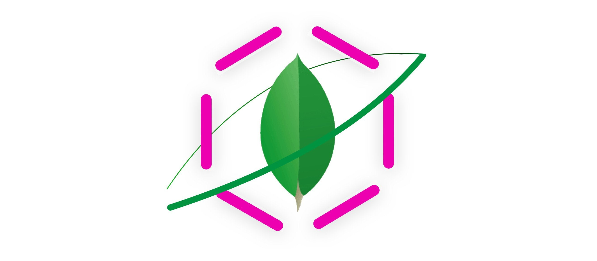

<h1 align="center">
<br>
  <a href="https://github.com/ugurcandede"></a>
<br>
<br>
GraphQL MongoDB Server
</h1>

<p align="center">GraphQL ve MongoDB Kullanan Örnek Uygulama.</p>

<hr />

GraphQL ve MongoDB kullanılarak oluşturulmuş örnek bir uygulama. `Mutation`, `Query` ve `Subscription` parametreleri çalışmaktadır.

## Projenin Hazırlanması

1. Projeyi cihazınıza kopyalayın: `git clone https://github.com/ugurcandede/MongoDB-GraphQL`
2. Proje dizinine gidin: `cd MongoDB-GraphQL`.
3. `yarn` veya `npm install` komutu ile gerekli kütüphaneleri indirin.
4. `.env` dosyası oluşturup içerisine aşağıdaki gibi MongoDB adresini ve çalışmak istediğiniz PORT numarasını yazın.

```
  mongoURI=mongodb://localhost:27017/graphql
  PORT=7856
```

6. `yarn start` veya `yarn serve` komutu ile projeyi çalıştırın.
7. Proje `http://localhost:7856/playground` adresinde çalışır halde olacaktır.

## Örnek Komutlar

Yeni Kullanıcı Oluşturma

```graphql
mutation {
  createUser(
    user: {
      name: "Ugurcan Dede"
      email: "ugurcan@dede.com"
      password: "123456789"
    }
  ) {
    _id
    name
    password
    email
  }
}
```

Gerçek Zamanlı Yeni Kayıt Olan Kullanıcıları Listeleme

```graphql
subscription {
  user {
    _id
    name
    email
  }
}
```

Oluşturulmuş Bütün Gönderileri Listeleme

```graphql
{
  posts {
    _id
    title
    body
    published
    author {
      name
      email
    }
    date {
      published
      updated
    }
  }
}
```

## Lisans

Proje MIT Lisansına Sahiptir , Copyright (c) 2021 Ugurcan Dede.
